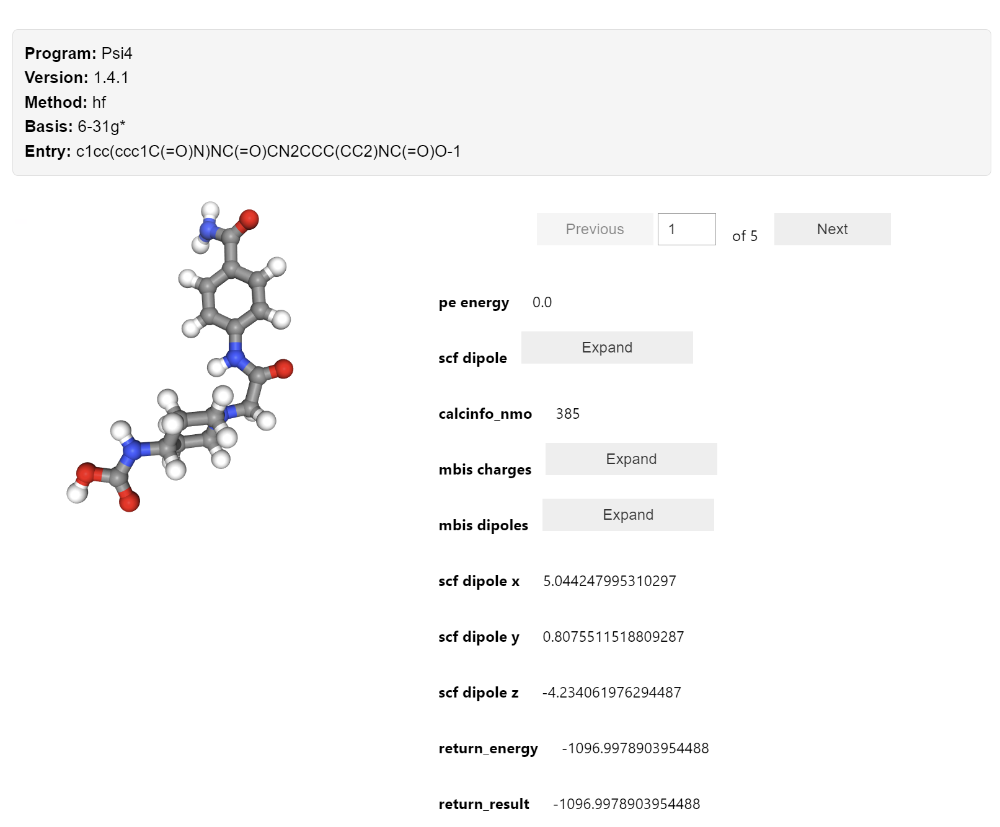
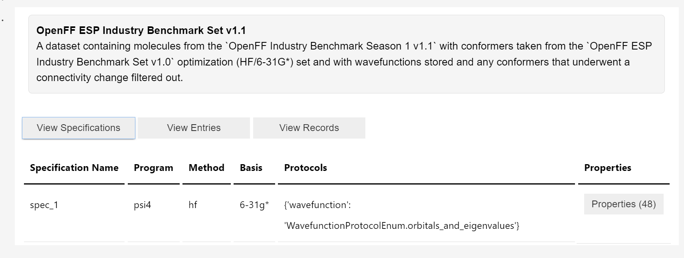
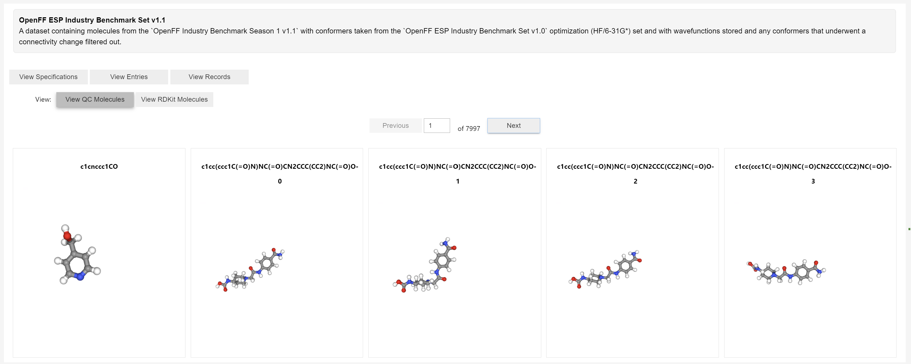
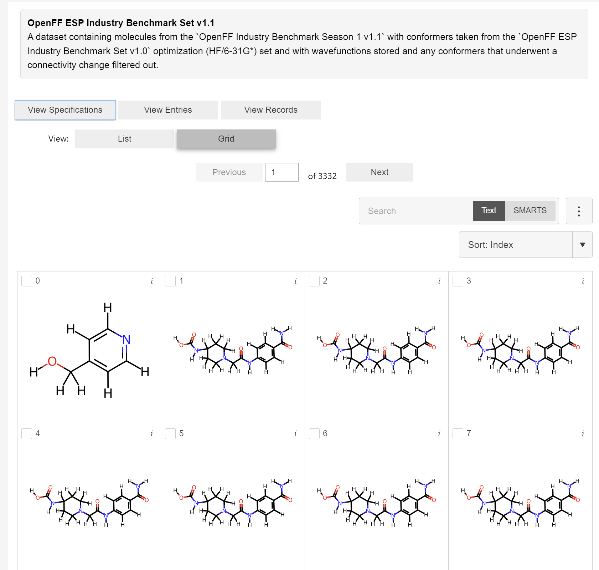

# qcbrowser-prototype
A prototype for structures and widgets for browsing datasets from QCArchive.

Create an environment with the following command:
```bash
conda create -n qcbrowser-prototype -c conda-forge python=3.12 jupyterlab qcportal openff-toolkit mols2grid nglview
```

See `demo.ipynb` for a demonstration of the pandas tools and widgets.

## Pandas DataFrame Tools

The QCBrowser has both capabilities for building dataframes from datasets and widgets for visualizing and browsing datasets. See `demo.ipynb`.

## Widgets

This repository contains code for dataframe tools and widgets for browsing datasets from QCArchive. 

Here are some screenshots of the widgets in action (more documentation is coming soon, see demo notebook):

### Record Browser Widget


### Dataset Browser Widget
The default view shows the specificatiosn with each specification having an expandable list of properties.

**View Specifications**  


**View Entries**

You can view the entries as the QCElemental representation.


The OpenFF Toolkit is also used internally to convert entries to RDKit. If the dataset has entries that can be converted, you can browse the entries in a grid view using `mols2grid`.

